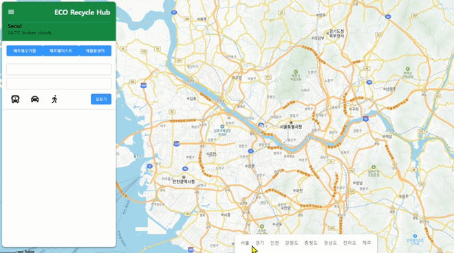
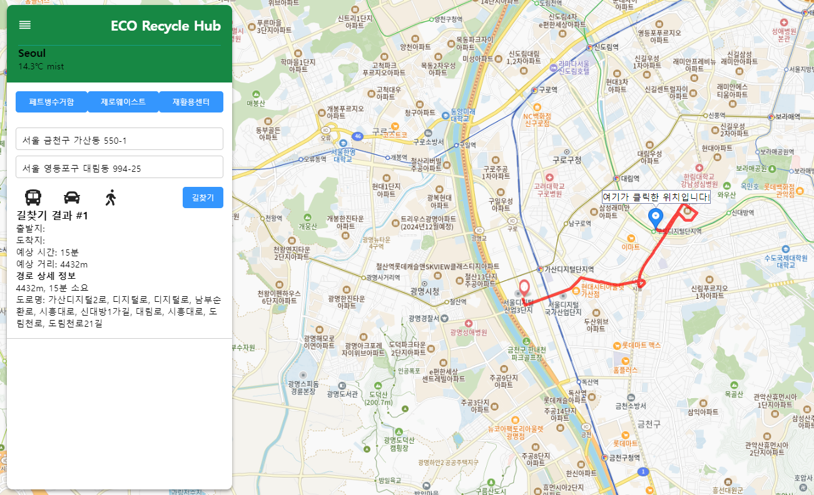
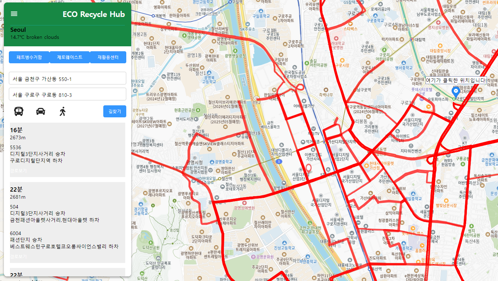
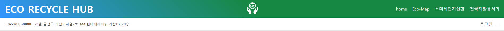
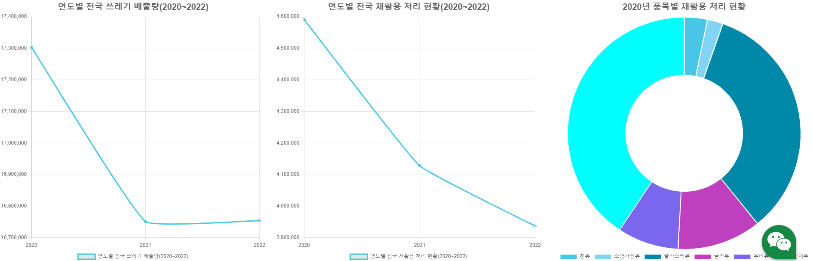
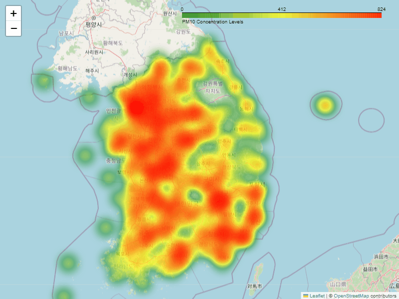

# Eco Recyle Hub(에코 리사이클 허브)

 ## 프로젝트 소개

>이 프로젝트는 이용자, 더 나아가 우리 모두에게 재활용 생활화를 독려하며 유용한 정보와 서비스 제공을 목표로 합니다.
>
>사용자에게 지도 기능을 중점으로 재활용 센터, 페트병 수거 자판기, 제로 웨이스트 샵과 같은 재활용 관련 시설의 정보를 제공하며, 폐기물 배출량과 미세먼지 농도와 같은 환경 지표를 시각적으로 제공하여 사용자들이 지역의 환경 상태를 쉽게 파악할 수 있도록 돕습니다. 또한, 사용자의 위치를 기준으로 가장 가까운 제로 웨이스트 샵까지의 길찾기 기능을 개발하여 좀 더 간편한 서비스를 제공합니다.
>
>이를 통해 우리는 각자의 일상 속에서 환경을 생각하고 실천을 독려하고자 합니다.

## 팀원 소개
코드랩 아카데미 AI 인공지능컨택센터(AICC) 웹서비스개발 1차(23/12/21 ~ 24/06/26)  
강연배, 김인수, 이지우, 김은지

## 개발 기간
### 2024.04.05(금) ~ 2024.05.03(금)
  + 04/05 ~ 04/12
    + 기술 스택 회의
    + 자료 수집과 선정
    + 역할 배분

  + 04/15 ~ 04/19
    + 데이터 수집
    + 수집자료 정제 작업
    + 전반적인 Web 디자인
    + 맵 관련 기능 구현
    + 차트 구현
    + 미세먼지 현황 구현

  + 04/22 ~ 04/27
    + 맵 관련 기능 구현
    + UI/UX 디자인
    + 차트 구현
    + 미세먼지 현황 구현
    + 서버 구현

  + 04/29 ~ 05/03
    + 서버 구현
    + UI/UX 디자인
    + 기타 부가 기능 구현
    + 실시간차트 추가구현

## 개발환경
- IDE: IntelliJ, Pycham
- Server: NodeJS
- Design: Figma

## 기술 스택
- NodeJS
- Express
- React
- Python
- AWS

## 기획안
- 주제선정:

## 프로젝트 아키텍쳐

## 기능 리뷰
### 주요 기능
+ 지도
   + 페트병수거함, 제로웨이스트, 재활용센터의 위치를 파이썬에서 처리하여 리액트로 송출
   + shp파일(지리적파일)을 가져와 파이썬에서 서버로 송출하여 리액트로 2번 정제 후 지도에 표시
   + 모든 위치 자료는 파이썬을 화영하여 SQL에 저장.
     + 재활용센터: 전국재활용센터표준데이터(https://www.data.go.kr/data/15021108/standard.do)
     + 페트병수거함: 해당 사이트에서 웹 스크랩핑 후 csv 파일로 변환하여 파이썬으로 정제
     + 제로웨이스트샵: 사용자가 제작한 구글맵 kml 파일을 가져와 SQL 적재
    
 
    
 + 길찾기
   + 사용자위치 기반
     + Geolocation 기능을 사용해 사용자에게 위치서비스를 요청, 승인한다면 현재 위치를 반환한다.
     + 카카오맵 API를 활용하여 맵의 클릭좌표를 받아온다.
     + 출발 위치부터 도착 위치까지 최단거리를 Polyline으로 표현한다.
   + 자동차 길찾기
     + 걸리는 시간과 경유하는 도로, 거리를 계산한다.
     + 자동표시: 카카오API 활용
   + 대중교통 길찾기
     + 대중교통 API 로 사용자 위치~클릭한 위치까지의 버스.지하철노선을 텍스트타입으로 보여준다. 
     + 대중교통API 에서나온 버스와 지하철 ID 값을 버스.지하철 노선 API에 보내어 노선별 정류소의 위경도값을 지도상에 나타낸다.

 
 

- - -
+ 챗봇 소개
  + 서버로 보내놓은 모든 데이터를 챗봇에서 대답할 수 있도록 한다.
  + 텍스트와 음성 모두 가능하고, 음성말할경우 띄어말하기와 상관없이 서버에서 오는값들중 사용자가 말하거나 입력한 값이 있으면 답변이 가능하도록 구현하였다. 
- - -
+ 차트
  + Charths를 이용해 자원순환실천플랫폼에서 제공하는 전국폐기물 발생 및 처리현황 자료를 데이터분석하여 대한민국의 과거 분리배출 결과를 시작적으로 제공한다.

 

 

- - -
+ 미세먼지 농도
  + 미세먼지 gif
  + 미세먼지 관측소(662곳)에서 24시간 관측한 미세먼지량을 분석하여 농도에 따라 컬러를 지정
  + 해당 자료를 클러스터로 지정하여 지도에 배포한다.
  + 해당 자료는 1시간 간격으로 총 24개, gif으로 병합 후 마무리한다.
    

- - -
+ 로그인구현
  + oracle SQL 과 연결하여, 리액트로 로그인구현. 
## 차후 개선 포인트
+ 전반적인 UI 리뉴얼
+ 회원가입 및 마이페이지 추가예정
+ 버스길찾기에서 현위치~클릭위치까지의 버스노선만 나오게 수정예정

- - -
## API
Open Weather(https://openweathermap.org/)  
리액트 카카오맵(https://react-kakao-maps-sdk.jaeseokim.dev/)  
서울특별시_대중교통환승경로 조회 서비스(https://www.data.go.kr/iim/api/selectAPIAcountView.do)

## 라이브러리
react-icons  
react-bootstrap  

## 자료제공
자원순환마루(https://www.recycling-info.or.kr/rrs/main.do)  
공공데이터포털_전국재활용센터표준데이터(https://www.data.go.kr/data/15021108/standard.do)  
공공데이터포털()
